# Hi, I'm Akhil

I build applied AI systems, mostly retrieval-augmented generation, LLM evaluation and real-time computer vision. I'm a final-year B.Tech IT student at Matrusri Engineering College, Hyderabad (CGPA 8.64, graduating 2027).

<h3><code>akhil@github ~ $ ./contributions.sh</code></h3>

  

<h3><code>akhil@github ~ $ neofetch</code></h3>
<table>
  <tr>
    <td valign="top"></td>
    <td valign="top"></td>
  </tr>
</table>

### Right now

- AI Engineering Intern at AMIK Technologies. I work on RAG pipelines over internal docs, schema-validated structured outputs, an eval harness for retrieval relevance and faithfulness, and FastAPI model serving with streaming and provider fallback.
- Freelance AI Trainer at Handshake AI. I write terminal-based benchmark tasks that evaluate frontier AI coding agents: 100+ tasks across 10 domains, each shipped with a Dockerised environment, a test-based verifier, and a reference solution.

### Projects

| Project | What it is | Stack |
|---|---|---|
| [rbi-rag-eval](https://github.com/Akhil-Prasad09/rbi-rag-eval) | RAG over RBI's foreign exchange rules, graded against RBI's own FAQs: calibrated relevance judge, bootstrap CIs, and a cross-validated refusal gate (correct refusals 33% → 75%) | Python, sentence-transformers, Ollama |
| [e2ee-chat](https://github.com/Akhil-Prasad09/e2ee-chat) | End-to-end encrypted group chat: keys generated on-device, a relay server that can't read messages, key pinning and safety numbers; tests include a malicious-server key-swap attack | Python, cryptography, PyQt5 |
| [knee-mri-detect](https://github.com/Akhil-Prasad09/knee-mri-detect) | Knee MRI abnormality detection with Grad-CAM explanations and a clinician-facing web app (B.Tech major project) | PyTorch, EfficientNet-B3, FastAPI, React, Docker |
| [cag-emotion-tracker](https://github.com/Akhil-Prasad09/cag-emotion-tracker) · [live demo](https://akhil-prasad09.github.io/cag-emotion-tracker/) | Real-time webcam emotion recognition: CNN + prototype-cache lookup, 70.6% on FER-2013 at ~8 ms per frame on CPU. The demo runs fully in the browser | PyTorch, OpenCV, Streamlit |
| [Portfolio](https://akhil-prasad09.github.io) | My site, a static Next.js export on GitHub Pages | Next.js, TypeScript, Three.js |
| [OIBSP](https://github.com/Akhil-Prasad09/OIBSP) | Python apps from my Oasis Infobyte internship: voice assistant, weather CLI, multi-client TCP chat | Python |

Tools I reach for: Python · PyTorch · Hugging Face · OpenCV · FastAPI · SQL · React · Docker · Linux

Get in touch: [Portfolio](https://akhil-prasad09.github.io) · [LinkedIn](https://www.linkedin.com/in/akhil-prasad-972043289/)

I'm looking for AI/ML and Python backend roles.
